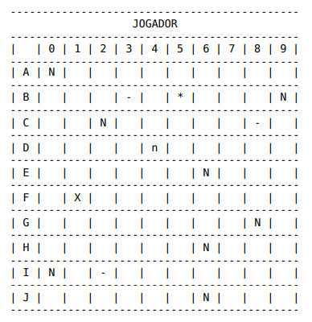

# Jogo de Batalha Naval

Jogo de Batalha Naval desenvolvido em linguagem Java.

Desafio final do módulo 06 (Introdução ao Java) do curso [Santander Coders | Web Full-Stack](https://app.becas-santander.com/pt/program/bolsas-santander-tecnologia-santander-coders-web-full-stack-2021), em parceria com a [Let's Code](https://letscode.com.br/).

## Funcionalidades

- Interface do jogo através de escolha de opções via terminal;
- Escolha do nome do jogador;
- Jogo contra o computador (IA);
- Escolha das posições do jogador de forma manual ou automática;
- Preview em tempo real do tabuleiro do jogador;
- Contagem de jogadas e exibição do ganhador ao final do jogo.

## Regras do Jogo

- O tabuleiro do jogo é uma matriz de dimensão **10 x 10**;
    - As linhas são referenciadas pelas letras **A** a **J**;
    - As colunas são referenciadas pelos números **0** a **9**;
- Todos os navios são do tipo submarino (ocupam apenas **uma** posição no tabuleiro);
- As marcações do tabuleiro seguem as regras abaixo:
    - Navio posicionado inicialmente em qualquer tabuleiro: __N__ (ene maiúsculo)
    - Tiro certeiro no tabuleiro do adversário: __*__ (asterisco)
    - Tiro na água no tabuleiro do adversário: __–__ (traço)
    - Tiro certeiro no tabuleiro do adversário com navio posicionado na mesma posição do seu tabuleiro: __X__ (xis maiúsculo)
    - Tiro na água no tabuleiro do adversário com navio posicionado na mesma posição do seu tabuleiro: __n__ (ene minúsculo)
- Exemplo de um tabuleiro com marcações:


## Dependências e Tecnologias Utilizadas

- Java (linguagem de desenvolvimento)
- Oracle OpenJDK 11.0.11 (*Java development kit* para compilação e execução do projeto);
- IntelliJ IDEA 2021.3 Ultimate Edition (IDE);
- Git e GitHub (colaboração e controle de versão de código-fonte);

## Execução do Projeto

### Clonando o projeto
- Crie uma pasta qualquer no seu computador local;
- Abra uma janela do terminal e acesse a pasta criada acima;
- Execute o comando abaixo:
```
git clone https://github.com/Rumeniggnv/BatalhaNaval.git
```

### Importando o projeto na IDE
- Abra o IntelliJ e acesse a opção: *File>New>Project from Existing Sources...*
- Na tela de diálogo que será aberta, navegue até a pasta raiz do projeto clonado na etapa anterior e selecione a mesma;

### Executando o projeto a partir da IDE IntelliJ
- Acesse a classe *Main* e execute o projeto a partir do método *main*.

### Compilando o artefato *jar* e executando o projeto pelo terminal
- Escolha a opção *BatalhaNavalJar* como configuração de build do projeto na IDE;
- Após o término bem-sucedido da compilação, abra uma janela do terminal e acesse a pasta abaixo:
```
<ProjectFolder>/out/artifacts/BatalhaNaval_Jar
```
- A partir da pasta acessada na etapa anterior, execute o comando abaixo:
```
java -jar BatalhaNaval.jar
```

> Para mais informações, acesse os links da nossa seção [Referências](#referências).

## Autores

Integrantes do Grupo 11:
- [Matheus Marques](https://github.com/Marques537)
- [Rumenigg Nogueira Vieira](https://github.com/Rumeniggnv)
- [Tulio de Paula Colmanetti](https://github.com/TulioColmanetti)

## Referências

- [Editor simples de arquivos README para projetos git](https://readme.so/pt)
- [Compile and build applications with IntelliJ IDEA](https://www.jetbrains.com/help/idea/compiling-applications.html)

## Agradecimentos

Nossos agradecimentos desse projeto são para:
- O nosso professor [Cristiano Neves](https://www.linkedin.com/in/cristianoneves/), com o qual adquirimos muito conhecimento que certamente fará toda a diferença em nossa jornada profissional.
- A equipe da [Let's Code](https://letscode.com.br/), por nos proporcionar esse curso super completo;

